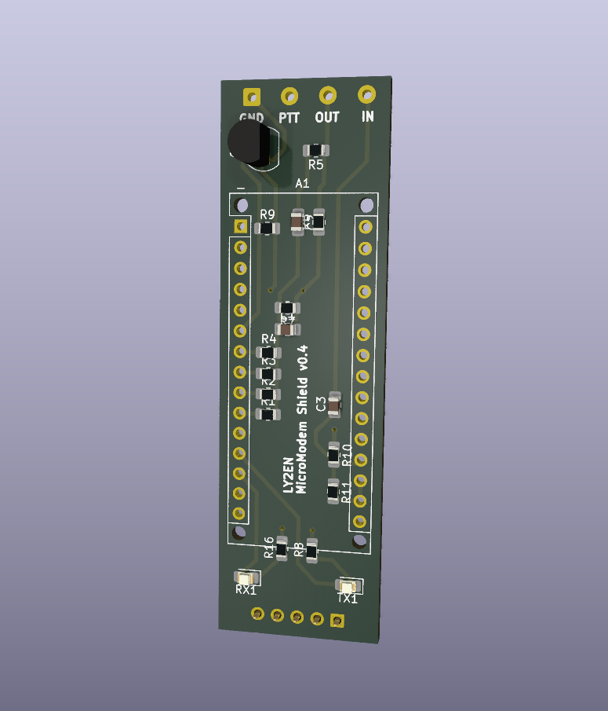

# LY2EN-made MicroModem Arduino Nano shield

PCB and schematics for a very basic [MicroModem](https://unsigned.io/micromodem/) shield for Arduino Nano to use with Baofeng radios.

## Disclaimer

This is experimental work. The authors do not hold any responsibility for any damage to your electronics components, wiring or other property when using this prototype. Use at your own risk.

## How to use

1. Upload the [MicroAPRS 3v KISS firmware](https://github.com/markqvist/MicroAPRS/raw/master/precompiled/microaprs-3v-kiss-latest.hex) to the Arduino Nano:

    avrdude -p m328p -c arduino -P /dev/ttyUSB0 -b 115200 -U flash:w:microaprs-3v-kiss-latest.hex

2. Plug the Arduino Nano into your Android phone's USB host

3. Launch [APRSDroid](https://aprsdroid.org/) 

    3.1 Select TNC (KISS) mode over USB. 
    
    3.2 Keep the baud rate at 9600.
    
4. Set the 3296W trimmer to something around 47kOhm. Your resistance might vary here. Once you're confident, you can replace it with a simple 47k resistor.

Verified working with both the MicroAPRS KISS and MicroAPRS SimpleSerial firmware for 3V.

## Cables

If you're not using a [Bluetooth SPP-C module](https://www.aliexpress.com/item/32998624269.html), a USB-C male to USB-A female adapter is required for recent Android smartphones.

Connect to Baofeng radio over [this cable](https://a.aliexpress.com/_mNhKQOm).

### Pinout
The Baofeng cable has two TRS (Tip, Ring, Sleeve) connectors.
#### 3.5mm
* Sleeve - PTT
* Ring - OUT
#### 2.5mm
* Sleeve - GND
* Tip - IN

### Case
3D printed sleeve case by 4X5MG

## Features / Changelog

### Version 0.4
* Added pin hole connector for SPP-C Bluetooth module

### Version 0.3 (verified)
* Upgraded to KiCad version 6
* Fixed edge cut layer (Edge.Cuts)
* Re-rendered PCB 3D visual with ray tracing
* Added JLCPCB compatible BOM and CPL files
* Ordered test batch from JLCPCB :)
* **Verified working!**

### Version 0.2
* Traces widened from 0.25 to 0.5mm
* Added GND area fill on the back side
* Signature added :)

### Version 0.1
* Only the ANALOG_IN, ANALOG_OUT and PTT are exposed.
* PTT wiring has been done as per Baofeng schematics.
* Tested with 3.3V MicroModem's [SimpleSerial](https://github.com/markqvist/MicroAPRS/raw/master/precompiled/microaprs-3v-ss-latest.hex) and [KISS](https://github.com/markqvist/MicroModemGP/raw/master/precompiled/MicroModemGP-3v-kiss.hex) firmware.
* Assuming that RST, XTAL, SPI pins, the CH340 and the rest of stuff is on the Nano already
* Wiring is done for 3.3V, so make sure to use the 3.3V MicroModem hex (see above).

## TODO

* Replace Q1 with SMT version

## Authors

PCB made by Simonas Kareiva LY2EN (<ly2en@qrz.lt>) using KiCad and by looking at the [original schematics](https://unsigned.io/wp-content/uploads/2014/12/Schematic-1.pdf).

Inspiration by [Vilius LY3FF](https://github.com/vilisas/).

MicroModem originally by https://github.com/markqvist
